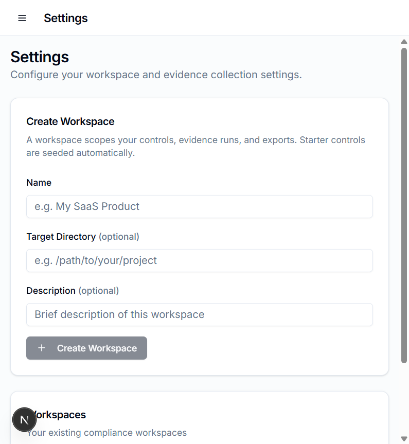
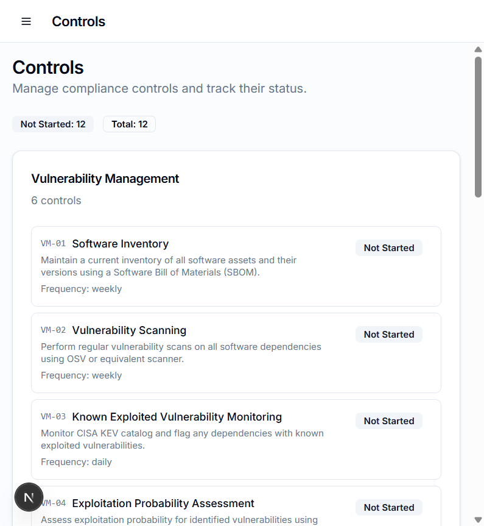
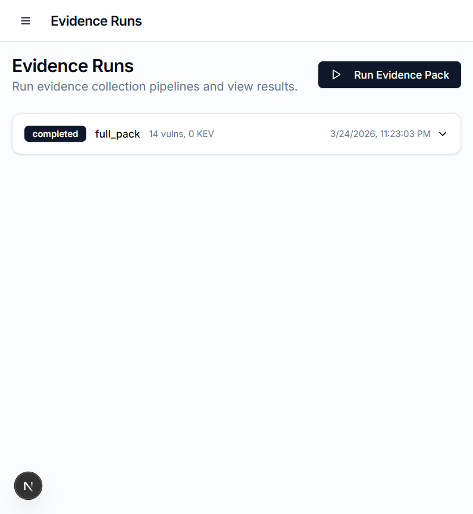
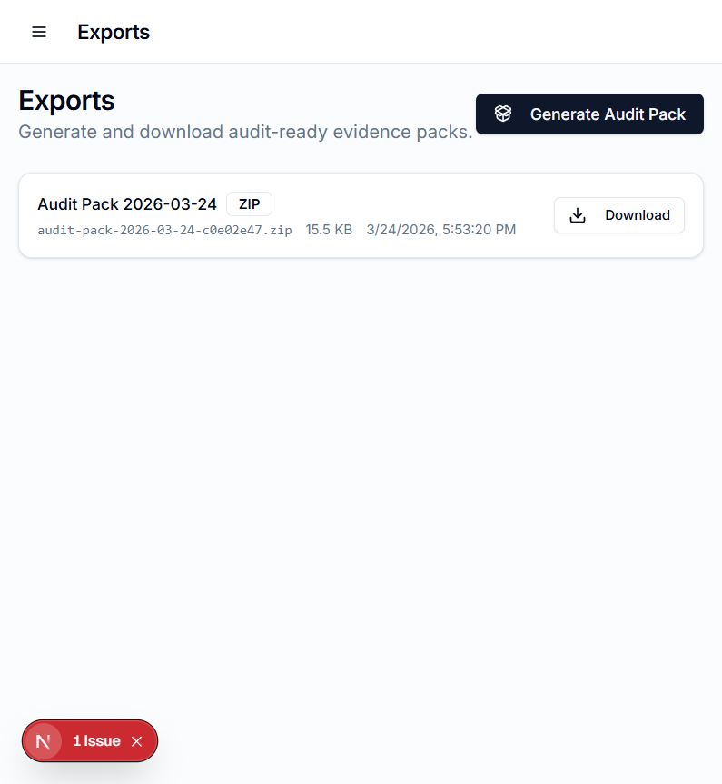
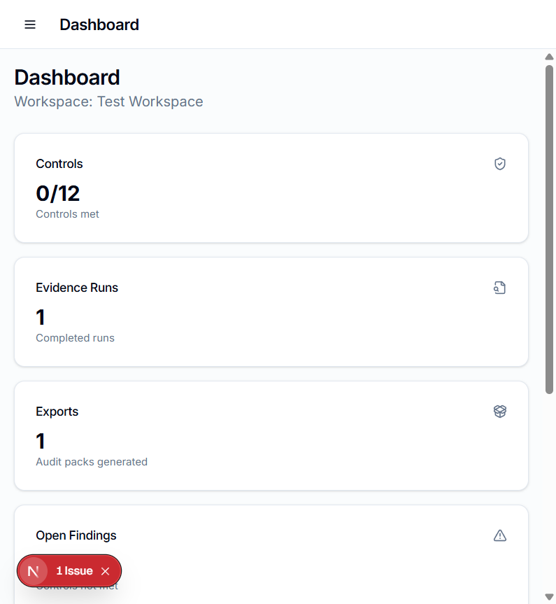

# Complyt User Guide

## What is Complyt?

Complyt is an open-source compliance automation toolkit that answers one question your auditor will definitely ask:

**"Show me your vulnerability management evidence."**

Instead of scrambling to collect screenshots, PDFs, and spreadsheets before an audit, Complyt generates a complete, auditor-ready **evidence pack** automatically by scanning your software dependencies and enriching the results with authoritative threat intelligence.

---

## Who is this for?

**Engineering leads and security/compliance owners at startups and SMBs** who are:

- Preparing for **SOC 2 Type I/II** or **ISO 27001** certification
- Blocked on an **enterprise deal** because the buyer wants proof of security posture
- Tired of **manually collecting evidence** via screenshots and spreadsheets
- Running a small team and can't afford $30K+/year for Vanta, Drata, or Secureframe

## What problem does it solve?

Auditors want proof that you:

1. **Know what software you're running** (Software Bill of Materials)
2. **Scan for vulnerabilities regularly** (vulnerability scanning evidence)
3. **Prioritize based on real-world risk** (are these actively exploited? how likely?)
4. **Track remediation** (control status tracking)

Complyt produces all of this in a single click, packaged as a ZIP file your auditor can consume directly.

---

## The 5-Minute Walkthrough

### Step 1: Create a Workspace

Go to **Settings** and create a workspace. A workspace scopes everything -- controls, scans, and exports -- to one project or product.



Enter your project name (e.g., "My SaaS Product"), optionally point it at your project directory, and click **Create Workspace**. Complyt automatically seeds 12 starter compliance controls covering vulnerability management, supply chain security, asset management, and data integrity.

---

### Step 2: Review Your Controls

Navigate to **Controls** to see the 12 pre-seeded controls organized by category.



Each control has:
- **Control ID** (e.g., VM-01, SCM-02) for reference
- **Title and description** explaining what the control requires
- **Frequency** (daily, weekly, monthly, quarterly)
- **Status badge** you can click to cycle through: Not Started, In Progress, Met, Not Met

These controls are generic (no copyrighted standard text) and map to the kinds of things SOC 2 and ISO 27001 auditors look for under vulnerability management.

---

### Step 3: Run an Evidence Pack

This is where the real value is. Go to **Evidence Runs** and click **Run Evidence Pack**.



Complyt executes a 4-step pipeline:

| Step | What it does | Output |
|------|-------------|--------|
| **1. SBOM** | Parses your `package.json` and lockfile into a CycloneDX 1.5 Software Bill of Materials | `sbom.json` |
| **2. OSV Scan** | Queries each component against the [OSV.dev](https://osv.dev) vulnerability database | `osv.json` |
| **3. KEV Enrichment** | Downloads the [CISA Known Exploited Vulnerabilities](https://www.cisa.gov/known-exploited-vulnerabilities-catalog) catalog and flags any matches | Enrichment data |
| **4. EPSS Scoring** | Queries the [FIRST EPSS API](https://www.first.org/epss/) for exploitation probability scores | Enrichment data |

The enriched output (`osv_enriched.json`) combines all of this: for every vulnerability found, you know whether it's **actively exploited in the wild** (KEV) and its **probability of exploitation** (EPSS score 0-1).

This is exactly what CISA recommends for vulnerability remediation prioritization.

---

### Step 4: Export an Audit Pack

Go to **Exports** and click **Generate Audit Pack**.



Complyt produces a ZIP file containing:

| File | What it is |
|------|-----------|
| `sbom.json` | CycloneDX 1.5 Software Bill of Materials |
| `osv.json` | Raw vulnerability scan results from OSV.dev |
| `osv_enriched.json` | Vulnerabilities enriched with KEV flags and EPSS scores |
| `control-matrix.csv` | Your control status matrix (importable into any spreadsheet) |
| `evidence-manifest.json` | Machine-readable manifest with SHA-256 hashes for every artifact |
| `README.md` | Human-readable explanation of each file and its provenance |

Every artifact includes cryptographic integrity hashes and timestamps. The manifest is machine-readable so it can feed into other compliance tools.

Click **Download** to get the ZIP. Hand it to your auditor.

---

### Step 5: Monitor from the Dashboard

The **Dashboard** gives you a real-time overview of your compliance posture.



At a glance you can see:
- **Controls met** vs total (0/12 means you just started; update statuses as you work through them)
- **Evidence runs** completed
- **Exports** generated
- **Open findings** (controls marked "Not Met")
- **Recent evidence runs** with vulnerability counts and KEV matches
- **Control coverage** breakdown by status

---

## Why should someone use Complyt instead of doing it manually?

| Manual approach | Complyt |
|----------------|---------|
| Screenshot your `npm audit` output every week | Automated SBOM + OSV scan with structured JSON |
| Google each CVE to see if it's critical | Automatic KEV + EPSS enrichment with real-world exploitation data |
| Copy-paste into a spreadsheet for your auditor | One-click ZIP export with integrity hashes |
| Spend 2-4 hours per audit cycle collecting evidence | Run completes in ~10 seconds |
| Evidence has no provenance trail | Every artifact has SHA-256 hash, timestamp, and generator metadata |
| Costs $0 but wastes your time | Costs $0 and saves your time |

## Why should someone use Complyt instead of Vanta/Drata/Secureframe?

| Paid platforms ($15K-$50K/year) | Complyt (free, open source) |
|--------------------------------|----------------------------|
| Hosted SaaS -- your data on their servers | Runs locally -- your data never leaves your machine |
| Vendor lock-in on exports and integrations | Open formats (CycloneDX, JSON, CSV) |
| Opaque pricing, demo-gated | Apache-2.0, fork it, extend it |
| Full GRC platform (you're paying for features you don't need yet) | Focused on the #1 thing auditors ask for: vulnerability management evidence |
| Requires onboarding call and setup | `pnpm install && pnpm dev` -- running in 60 seconds |

Complyt is not a replacement for Vanta -- it's what you use **before** you can afford Vanta, or **instead of** Vanta if all you need is vulnerability management evidence.

---

## How it works under the hood

```
Your project                   Complyt                      External APIs
┌─────────────┐      ┌──────────────────────┐      ┌─────────────────────┐
│ package.json │─────>│ SBOM Generator       │      │ OSV.dev API         │
│ lockfile     │      │ (CycloneDX 1.5)      │      │ (vuln database)     │
└─────────────┘      │         │             │      └─────────┬───────────┘
                     │         v             │                │
                     │  ┌──────────────┐     │<───────────────┘
                     │  │ OSV Scanner   │     │
                     │  └──────┬───────┘     │      ┌─────────────────────┐
                     │         v             │      │ CISA KEV            │
                     │  ┌──────────────┐     │<─────│ (exploited vulns)   │
                     │  │ Enrichment   │     │      └─────────────────────┘
                     │  │ KEV + EPSS   │     │      ┌─────────────────────┐
                     │  └──────┬───────┘     │<─────│ FIRST EPSS API      │
                     │         v             │      │ (exploit probability)│
                     │  ┌──────────────┐     │      └─────────────────────┘
                     │  │ Audit Pack   │     │
                     │  │ ZIP Export   │     │
                     │  └──────────────┘     │
                     └──────────────────────┘
                              │
                              v
                     ┌──────────────────┐
                     │ audit-pack.zip   │
                     │  - sbom.json     │
                     │  - osv.json      │
                     │  - enriched.json │
                     │  - controls.csv  │
                     │  - manifest.json │
                     │  - README.md     │
                     └──────────────────┘
```

All network calls are:
- **Optional**: SBOM generation works fully offline
- **Cached**: KEV catalog cached for 24 hours
- **Resilient**: 10s timeouts, 3x retries with exponential backoff
- **Transparent**: offline runs are marked as such in the evidence

---

## Data sources and their authority

| Source | Maintained by | Why it matters |
|--------|--------------|----------------|
| [OSV.dev](https://osv.dev) | Google / OpenSSF | Largest open vulnerability database, aggregates from 20+ sources |
| [CISA KEV](https://www.cisa.gov/known-exploited-vulnerabilities-catalog) | US Cybersecurity and Infrastructure Security Agency | The definitive list of vulnerabilities being actively exploited. CISA explicitly recommends using it for remediation prioritization |
| [FIRST EPSS](https://www.first.org/epss/) | Forum of Incident Response and Security Teams | Statistical model predicting exploitation probability. Helps distinguish "theoretically exploitable" from "likely to be exploited" |
| [CycloneDX](https://cyclonedx.org/) | OWASP | International standard for SBOMs, widely accepted by auditors |

---

## Quick Start

```bash
git clone https://github.com/Coder-JK/Complyt.git
cd Complyt
pnpm install
pnpm dev
```

Open http://localhost:3000, create a workspace, run an evidence pack, export it. Done.
